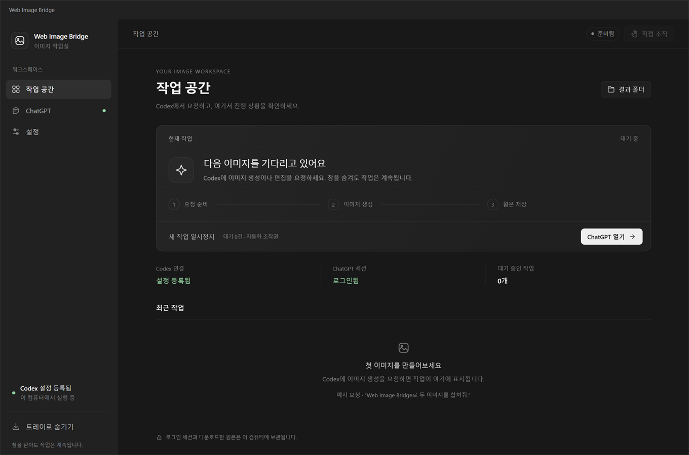
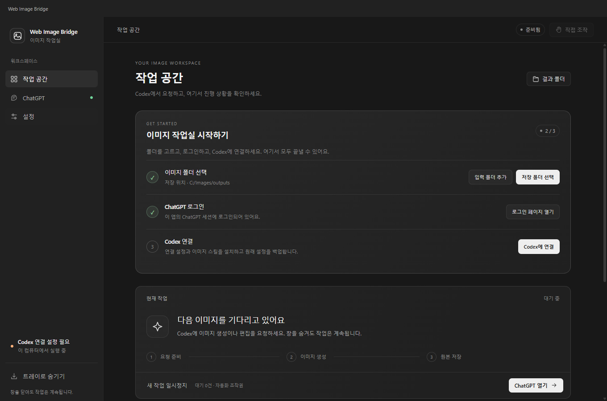
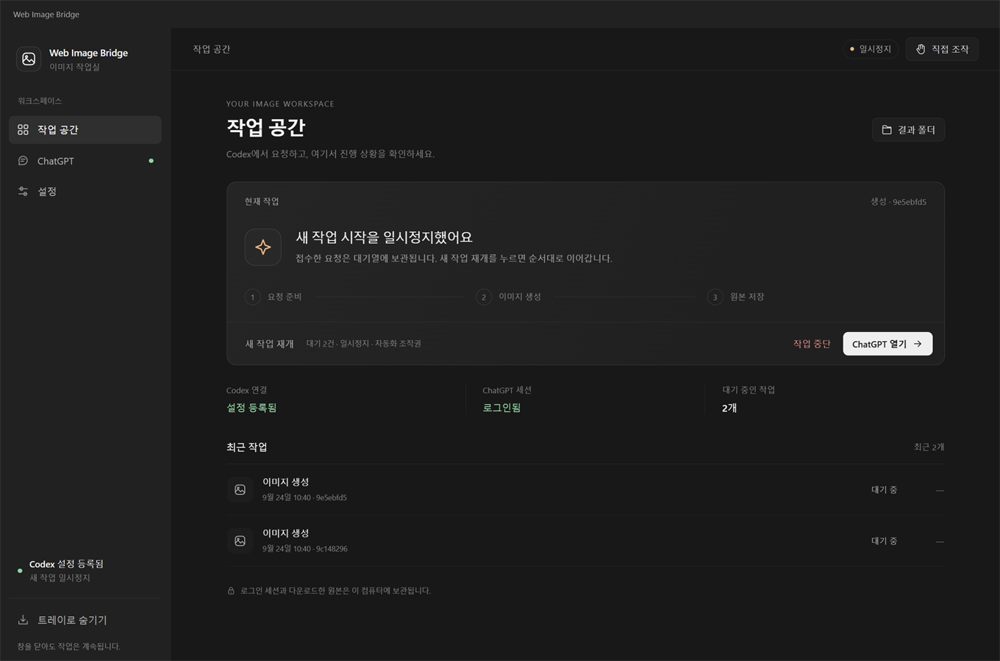

<p align="center">
  
</p>

<h1 align="center">Web Image Bridge</h1>

<p align="center"><strong>Ask in Codex, generate in ChatGPT, keep the original file</strong></p>
<p align="center">A Windows image workspace that connects your signed-in ChatGPT web session to your project folders</p>

<p align="center">
  <a href="https://github.com/tttaliesin/codex-image-web-gpt/releases/latest">Download for Windows</a> ·
  <a href="#getting-started">Install and first image</a> ·
  <a href="#workflow">Screens and behavior</a> ·
  <a href="#development">Development</a>
</p>

<p align="center"><strong>English</strong> · <a href="README.md">한국어</a></p>



<p align="center"><sub>Windows 11 x64 · Dedicated sign-in session · Local MCP · Runs in the tray</sub></p>

Ask Codex to generate or edit an image. The app runs the request on the ChatGPT website, downloads the original, and saves it to your project folder.

It uses your own ChatGPT web session instead of a separate image API key. Codex writes the prompt and reviews the result.

The screenshots show the Korean interface. You can switch the app to English in the setup guide or in **Settings → Language**.

## From one request to the original file

**Request in Codex → generate or edit on ChatGPT web → download the original → save to an allowed folder**

Example: combine two reference images into one scene.

Replace the paths with the absolute paths of real images, and pick the input and output folders in the app.

```text
Use Web Image Bridge to combine the two images below into one scene.

1. C:/Images/subject.png — reference for the main character's appearance
2. C:/Images/room.jpg — reference for the background and composition

Place the character from the first image naturally in the space from the second image.
Save the original result to the project's outputs folder.
```

After you check the result, continue editing in the same Codex task:

```text
In the last result, change only the background lighting to a cool blue.
Keep the character's appearance and placement as they are.
```

The edit continues the same ChatGPT conversation and previous result. When it finishes, open the downloaded original at the path Codex reports.

<a id="getting-started"></a>

## Getting started

**You need:** Windows 11 x64, Codex, and a ChatGPT account that can generate images.

### 1. Unzip and open the app

Download the Windows x64 ZIP from the [latest release](https://github.com/tttaliesin/codex-image-web-gpt/releases/latest) and unzip it.

**Double-click `WebImageBridge.exe`** in the unzipped folder.

The ZIP includes the runtime it needs. You don't need a terminal, Node, pnpm, or mise.

### 2. Finish three steps in the app



Pick **한국어** or **English** at the top of the setup guide first. You can change it later in **Settings**.

1. **Choose a results folder** — where generated originals are saved. To use reference images, also **add an input folder**.
2. **Open the sign-in page** — sign in to ChatGPT inside the app. If you're already signed in, it's used as is.
3. **Connect Codex** — installs the app, writes the connection settings, registers the image skill and checks the local connection in one step.

When it's done, you can start the app from the **Web Image Bridge** shortcut on your desktop.

Your existing Codex settings are backed up. Sign-in, model and other settings are kept.

If an existing skill or server entry with the same name conflicts, the app tells you and stops without overwriting unrelated files.

### 3. Request your first image

**Restart Codex once**, then use the app's **Copy first request** button and paste the request into Codex.

Example request with your chosen results folder:

```text
Use Web Image Bridge to draw a small ceramic vase on a white background.
Save the original result to the C:/Images/outputs folder.
```

Check that the job shows as complete in the app, and open the original file at the path Codex reports.

<details>
<summary>Changing folders, updating, disconnecting</summary>

**Changing folders:** in the app's **Settings**, add or remove input folders and change the results folder.

Changes apply right away when no job is running or waiting.

**Language:** switch between 한국어 and English in **Settings → Language**. The app, tray menu and confirmation dialogs change together.

**Updating:** quit the old app from the tray, run `WebImageBridge.exe` from the new ZIP, then click **Update app**.

Sign-in, job history, folder settings and originals are kept, and the desktop shortcut points to the new version.

**Disconnecting:** click **Settings → Disconnect** in the app.

Personal skills are moved to a backup in the install folder. Sign-in, job history and originals are kept.

If an update changes the installed skill, follow the app's prompt to disconnect, connect again and restart Codex.

Only to go back to the previous version, run this in PowerShell in the package folder:

```powershell
# Roll back to the previous version, then restart the app
./setup.ps1 -Action rollback

```

For manual installs, use `setup.ps1` and the [configuration example](examples/mcp-config.example.json).

</details>

<a id="workflow"></a>

## Screens and behavior

**See progress and the queue in one place**

The workspace shows each step — preparing the request, generating the image, saving the original — and recent jobs.

If you pause new jobs, incoming requests wait in the queue and run in order when you resume.



Screenshots show the real app UI with local test data. The sign-in state, folder paths and job details are test data too.

- **Work continues while hidden** — the app keeps running in the tray, and accepted jobs survive a dropped Codex connection.
- **Take control when needed** — open the ChatGPT page to sign in or pass a human check, then hand control back to automation.
- **Recover from existing results** — if a download fails, the file is collected again from the existing response; if an export fails, the stored original is copied again.
- **No duplicate generations** — if it's unclear whether a request was sent, the app checks the existing conversation and history and blocks automatic resending.

Sign-in sessions, job history and originals stay on this computer. Input and export are limited to folders you allow.

The window's X button hides the app to the tray. To quit completely, use **Quit app** in the tray menu.

<a id="development"></a>

## Development

To run and build from source, also install mise, then install the pinned tools and dependencies from PowerShell in the project root:

```powershell
./scripts/mise.ps1 trust mise.toml
./scripts/mise.ps1 install --locked
./scripts/mise.ps1 run sync
./scripts/mise.ps1 run dev:fixture
```

`dev:fixture` is a local test mode for checking screens and behavior without an account.

| Command | Purpose |
| --- | --- |
| `./scripts/mise.ps1 run check` | Type, format and unit checks plus the build |
| `./scripts/mise.ps1 run test:integration` | Local Electron behavior checks |
| `./scripts/mise.ps1 run test:recovery` | Process kill and restart recovery checks |
| `./scripts/mise.ps1 run check:public` | Checks that files published to Git contain no local state or credentials |
| `./scripts/mise.ps1 run package:windows` | Builds the Windows install ZIP |

Build output goes to `.local/releases`, and the latest package path is written to `.local/latest-package.json`.

A package you build yourself works the same way: unzip it and start with `WebImageBridge.exe`.

Windows packaging builds the console-less launcher with the Windows .NET Framework 4.x compiler.
The compiler is found at `%WINDIR%/Microsoft.NET/Framework64/v4.0.30319/csc.exe`; no extra .NET SDK is needed.

The [MCP contract](packages/contracts/schema.json) is the single source for runtime validation and generated types.

After changing the contract, update the types with `./scripts/mise.ps1 exec pnpm run contracts:generate` and run `run check`.

## Verification scope

Real image generation, follow-up edits in the same conversation and original downloads were verified on the Korean ChatGPT UI.

Local Electron behavior, folder selection and permission changes, Codex registration and removal, process recovery, the installed build and the MCP connection are checked.

- A full generation round trip from regular Codex and the full harness is still to be verified.
- ChatGPT UI changes and account or language differences may require adapter adjustments.
- Platforms other than Windows x64, code signing, MSI and automatic updates are not provided.

No public license has been chosen for the project source yet.
