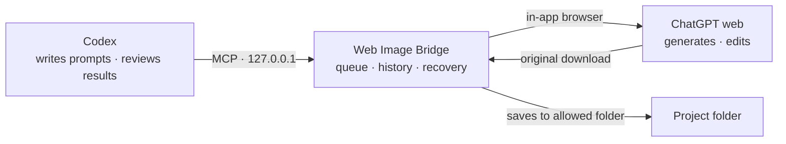

<p align="center">
  
</p>

<h1 align="center">Web Image Bridge</h1>

<p align="center"><strong>Ask in Codex, generate in ChatGPT, keep the original file</strong></p>
<p align="center">A Windows image workspace that connects your signed-in ChatGPT web session to your project folders</p>

<p align="center">
  <a href="https://github.com/tttaliesin/codex-image-web-gpt/releases/latest"></a>
  
  
  
</p>

<p align="center">
  <a href="https://github.com/tttaliesin/codex-image-web-gpt/releases/latest"><strong>Download for Windows</strong></a> ·
  <a href="#getting-started">Getting started</a> ·
  <a href="#troubleshooting">Troubleshooting</a> ·
  <a href="#development">Development</a>
</p>

<p align="center"><strong>English</strong> · <a href="README.md">한국어</a></p>


Ask Codex to generate or edit an image. The app runs the request in your own ChatGPT web session, downloads the **original file**, and saves it to your project folder.
No separate image API key is needed. Codex writes the prompt and reviews the result; the app handles the browser, downloads and recovery.

The screenshots show the Korean interface. Choose English in the setup guide or in **Settings → Language**.

> [!NOTE]
> This tool is not made or endorsed by OpenAI. It uses your own ChatGPT account and image generation limits, so check the ChatGPT terms of use and usage limits before you use it.

## Contents

- [Features](#features)
- [How it works](#how-it-works)
- [Download](#download)
- [Getting started](#getting-started)
- [Examples](#usage)
- [Updating and disconnecting](#updating)
- [Troubleshooting](#troubleshooting)
- [Privacy and security](#privacy)
- [Verification scope and limits](#scope)
- [Development](#development)
- [Contributing and license](#contributing)

<a id="features"></a>

## Features

- 🖼️ **Original files, not previews** — downloads the original file ChatGPT provides, not a preview or screenshot, and saves it to a folder you allow.
- 🔁 **Follow-up edits in the same conversation** — continues from the previous result and ChatGPT conversation, so you can ask for things like "change only the lighting".
- 🧩 **One-click Codex setup** — installs the app, writes the Codex connection settings, registers the image skill and checks the local connection in one step. Your existing Codex settings are backed up.
- 📋 **Queue and pause** — requests run in order. Pause new jobs and incoming requests wait in the queue.
- 🛟 **Work survives interruptions** — jobs keep running from the tray when the window is closed or Codex disconnects, and failed downloads or exports are recovered from existing results.
- 🚫 **No duplicate generations** — if it's unclear whether a request was sent, the app checks the existing conversation and history and blocks automatic resending.
- ✋ **Take control when needed** — sign in or pass a human check on the ChatGPT page inside the app, then hand control back to automation.
- 🌐 **English and Korean** — pick a language in the setup guide or in Settings; the app, tray menu and confirmation dialogs change together.

<a id="how-it-works"></a>

## How it works



1. Codex follows the installed `imagegen` skill to prepare the request and submits it to the local MCP server.
2. The app records the request and runs it, in order, on the ChatGPT page inside the app.
3. When generation finishes, the app downloads and stores the original, then exports it to the folder Codex asked for.
4. Codex opens the result file itself to check it and reports the path.

<details>
<summary>The 8 MCP tools available to Codex</summary>

| Tool | Purpose |
| --- | --- |
| `web_image_status` | App, account, queue and capability status |
| `web_image_session` | Create ChatGPT conversations, show the page, manage control |
| `web_image_submit` | Store input images and accept a job |
| `web_image_get` | Look up a job by job ID or request ID |
| `web_image_wait` | Wait a bounded time for a job to change |
| `web_image_control` | Cancel, safely resume, or reconcile with existing results |
| `web_image_artifacts` | Details of verified original files |
| `web_image_export` | Export originals to an allowed folder, with retries |

Tool inputs and outputs are defined by the [MCP contract](packages/contracts/schema.json).

</details>

<a id="download"></a>

## Download

| Platform | File | Requirements |
| --- | --- | --- |
| Windows 11 x64 | [`web-image-bridge-<version>-windows-x64.zip`](https://github.com/tttaliesin/codex-image-web-gpt/releases/latest) | Codex, a ChatGPT account that can generate images |

The ZIP includes the runtime it needs. You don't need Node, pnpm or a terminal.

> [!IMPORTANT]
> There are no automatic updates or code signing yet. Download new versions from [Releases](https://github.com/tttaliesin/codex-image-web-gpt/releases) and [update](#updating) yourself. If Windows SmartScreen warns you on first launch, choose **More info → Run anyway**.

<details>
<summary>Verify the downloaded ZIP (SHA-256)</summary>

The file is intact if this command prints the same value as the release's `.sha256` file.

```powershell
(Get-FileHash .\web-image-bridge-<version>-windows-x64.zip -Algorithm SHA256).Hash.ToLower()
```

</details>

<a id="getting-started"></a>

## Getting started

### 1. Unzip and open the app

Unzip the file and **double-click `WebImageBridge.exe`** in the folder.

### 2. Finish the three setup steps


Pick **한국어** or **English** at the top. You can change it later in **Settings → Language**.

1. **Choose save folder** — pick where originals are saved. To use reference images, also choose **Add input folder**.
2. **Open sign-in page** — sign in to ChatGPT inside the app. If you're already signed in, it's used as is.
3. **Connect Codex** — installs the app, writes the connection settings, registers the image skill and checks the local connection in one step.

When it's done, you can open the app from the **Web Image Bridge** shortcut on your desktop.
Your existing Codex settings are backed up; sign-in, model and other settings stay as they are. If a skill or server entry with the same name conflicts, the app stops without touching unrelated files and tells you what to do.

The setup guide leaves the workspace once the first job is recorded or you choose **Close guide**. To see it again, choose **Settings → Setup guide → Show again**.

### 3. Request your first image

**Restart Codex once**, then paste the request from the app's **Copy first request** button into Codex.

```text
Use Web Image Bridge to draw a small ceramic vase on a white background.
Save the original result to the C:/Images/outputs folder.
```

Check that the job is complete in the app, and open the original file at the path Codex reports.

<a id="usage"></a>

## Examples

**Combine two reference images into one scene** — replace the paths with real absolute paths, and add that folder as an input folder in the app first.

```text
Use Web Image Bridge to combine the two images below into one scene.

1. C:/Images/subject.png — reference for the main character's appearance
2. C:/Images/room.jpg — reference for the background and composition

Place the character from the first image naturally in the space from the second image.
Save the original result to the project's outputs folder.
```

**Keep editing in the same task** — the edit continues from the previous result and ChatGPT conversation.

```text
In the last result, change only the background lighting to a cool blue.
Keep the character's appearance and placement as they are.
```

**Follow progress in the workspace** — it shows each step (preparing the request, generating the image, saving the original) and recent jobs. If you pause new jobs, incoming requests stay in the queue and run in order when you resume.


<sub>Screenshots show the real app with local test data. The sign-in state, folder paths and job details are test data too.</sub>

The window's X button hides the app to the tray. To quit completely, choose **Quit app** in the tray menu.

<a id="updating"></a>

## Updating and disconnecting

**Updating**

1. Quit the old app from the tray menu.
2. Unzip the new ZIP and run `WebImageBridge.exe`.
3. Choose **Update app** in the notice at the top of the workspace. The button is disabled briefly while it installs.

Sign-in, job history, folder settings, originals, language and Codex tool approvals are kept, and the desktop shortcut points to the new version.
If a version changes the installed skill, follow the app's prompt to disconnect, connect again and restart Codex.

**Disconnecting** — choose **Settings → Codex → Disconnect**. The installed skill moves to a backup in the install folder, and any skill you used before connecting goes back to its original place. Sign-in, job history and originals are kept.

**Changing folders** — in **Settings → Files**, add or remove input folders and change the save folder. Changes apply right away when no job is running or waiting.

<details>
<summary>Roll back to the previous version · manual install</summary>

Run this in PowerShell in the package folder, then reopen the app.

```powershell
./setup.ps1 -Action rollback
```

For manual installs, use `setup.ps1` and the [configuration example](examples/mcp-config.example.json).

</details>

<a id="troubleshooting"></a>

## Troubleshooting

<details>
<summary><strong>Codex can't find the <code>web_image_*</code> tools</strong></summary>

Codex reads the connection settings when it starts. Quit Codex completely, reopen it, and ask in a **new conversation**.
If that doesn't help, choose **Settings → Codex → Check connection** in the app and follow the message it shows.

</details>

<details>
<summary><strong>"Another imagegen skill is already in that location"</strong></summary>

A different `imagegen` skill is already installed, so the app stopped without touching its files.
Choose **Back up existing skill and connect** to back it up and connect. If you disconnect later, your original skill is put back.

</details>

<details>
<summary><strong>The app asks you to "Clean up old install"</strong></summary>

An old install left in the Codex app's private storage makes Codex use a different credential.
Choose **Clean up old install** in the workspace notice or in Settings; the app cleans it up and checks the connection again.

</details>

<details>
<summary><strong>An input image or save location is refused (<code>PATH_DENIED</code>)</strong></summary>

The app only reads and writes folders you allow. In **Settings → Files**, add the folder as an input folder or choose it as the save folder.
To keep editing a previous result, ask Codex to use the previous result itself rather than a file path.

</details>

<details>
<summary><strong>"Ask again in a new conversation"</strong></summary>

Another message was added to the ChatGPT conversation you were editing, so the request wasn't sent.
Ask again in a new Codex conversation; it edits using the previous result image as input.

</details>

<details>
<summary><strong>The app asks you to sign in or pass a human check</strong></summary>

Open **ChatGPT** in the sidebar, sign in or complete the check yourself, then choose **Return to automation** at the top. Waiting jobs continue.

</details>

<details>
<summary><strong>The Update app button doesn't respond</strong></summary>

The button is disabled briefly while an install runs. If it stays disabled, check that a save folder is set and that you're signed in to ChatGPT.

</details>

For anything else, please open an [issue](https://github.com/tttaliesin/codex-image-web-gpt/issues). Including the message shown in the app and the job ID helps find the cause.

<a id="privacy"></a>

## Privacy and security

- Sign-in sessions, job history and downloaded originals stay on this computer.
- The MCP server listens only on `127.0.0.1` and accepts only requests with its auth token. The token is encrypted with Windows protected storage.
- Reading input images and exporting results is limited to folders you allow.
- Diagnostic records never include prompts, attachment names, conversation paths or response text.

<a id="scope"></a>

## Verification scope and limits

- Real image generation, follow-up edits in the same conversation and original downloads were verified on the Korean ChatGPT interface.
- Local Electron behavior, folder selection and permission changes, Codex registration and removal, process recovery, the installed build and the MCP connection are covered by automated checks.
- ChatGPT interface changes and account or language differences may require page adapter adjustments.
- Platforms other than Windows x64, code signing, MSI installers and automatic updates are not provided.

<a id="development"></a>

## Development

To run and build from source, install [mise](https://mise.jdx.dev/), then install the pinned tools and dependencies from PowerShell in the project root:

```powershell
./scripts/mise.ps1 trust mise.toml
./scripts/mise.ps1 install --locked
./scripts/mise.ps1 run sync
./scripts/mise.ps1 run dev:fixture
```

`dev:fixture` is a local test mode for checking screens and behavior without a ChatGPT account.

| Command | Purpose |
| --- | --- |
| `./scripts/mise.ps1 run check` | Type, format and unit checks plus the build |
| `./scripts/mise.ps1 run test:integration` | Local Electron behavior checks |
| `./scripts/mise.ps1 run test:recovery` | Process kill and restart recovery checks |
| `./scripts/mise.ps1 run check:public` | Checks that files published to Git contain no local state or credentials |
| `./scripts/mise.ps1 run package:windows` | Builds the Windows install ZIP |

Build output goes to `.local/releases`, and the latest package path is written to `.local/latest-package.json`. A package you build yourself works the same way: unzip it and start with `WebImageBridge.exe`.

<details>
<summary>Project structure</summary>

| Path | Contents |
| --- | --- |
| `apps/desktop` | Electron app — window, tray and settings UI (`ui/`), main process (`src/`) |
| `packages/core` | Job engine and MCP tool handling |
| `packages/browser` | ChatGPT page automation (CDP) and download collection |
| `packages/storage` | SQLite history, original storage, folder permissions, exports |
| `packages/mcp` | Local MCP server |
| `packages/contracts` | MCP contract and generated types |
| `skills/imagegen` | Image skill installed into Codex |
| `scripts` | Install and registration, packaging and check scripts |
| `tests` | Unit, Electron and recovery checks |

</details>

Windows packaging builds the console-less launcher with the .NET Framework 4.x compiler included in Windows (`%WINDIR%/Microsoft.NET/Framework64/v4.0.30319/csc.exe`). No extra .NET SDK is needed.

The [MCP contract](packages/contracts/schema.json) is the single source for runtime validation and generated types. After changing it, update the types with `./scripts/mise.ps1 exec pnpm run contracts:generate` and run `run check`.

<a id="contributing"></a>

## Contributing and license

Please report bugs and ideas as [issues](https://github.com/tttaliesin/codex-image-web-gpt/issues). If you send code, make sure `run check`, `run test:integration` and `run check:public` pass.

No public license has been chosen for the project source yet.
