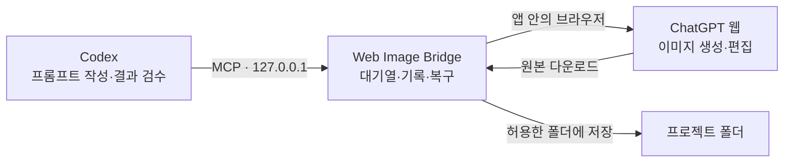

<p align="center">
  
</p>

<h1 align="center">Web Image Bridge</h1>

<p align="center"><strong>요청은 Codex에서, 생성은 ChatGPT에서, 결과는 원본으로</strong></p>
<p align="center">로그인한 ChatGPT 웹과 프로젝트 폴더를 잇는 Windows 이미지 작업실</p>

<p align="center">
  <a href="https://github.com/tttaliesin/codex-image-web-gpt/releases/latest"></a>
  
  
  
</p>

<p align="center">
  <a href="https://github.com/tttaliesin/codex-image-web-gpt/releases/latest"><strong>Windows 다운로드</strong></a> ·
  <a href="#getting-started">시작하기</a> ·
  <a href="#troubleshooting">문제 해결</a> ·
  <a href="#development">개발</a>
</p>

<p align="center"><a href="README.en.md">English</a> · <strong>한국어</strong></p>


Codex에 이미지 생성·편집을 요청하면 앱이 사용자의 ChatGPT 웹 세션에서 실행하고, 다운로드한 **원본 파일**을 프로젝트 폴더에 저장합니다.
별도 이미지 API 키는 필요 없습니다. 프롬프트 작성과 결과 검수는 Codex가, 브라우저 조작·다운로드·복구는 앱이 맡습니다.

> [!NOTE]
> OpenAI가 만들거나 보증하는 도구가 아닙니다. 사용자 본인의 ChatGPT 계정과 이미지 생성 한도를 사용하므로, ChatGPT 이용 약관과 사용 한도를 확인한 뒤 사용하세요.

## 목차

- [주요 기능](#features)
- [동작 방식](#how-it-works)
- [다운로드](#download)
- [시작하기](#getting-started)
- [사용 예시](#usage)
- [업데이트·연결 해제](#updating)
- [문제 해결](#troubleshooting)
- [개인정보와 보안](#privacy)
- [검증 범위와 한계](#scope)
- [개발](#development)
- [기여와 라이선스](#contributing)

<a id="features"></a>

## 주요 기능

- 🖼️ **원본 그대로 저장** — 미리보기나 화면 캡처가 아니라 ChatGPT가 제공하는 원본 파일을 내려받아 허용한 폴더에 저장합니다.
- 🔁 **같은 대화에서 이어서 편집** — 이전 결과와 ChatGPT 대화를 이어 붙여 "조명만 바꿔줘" 같은 후속 편집을 요청할 수 있습니다.
- 🧩 **Codex 연결 한 번에** — 앱 설치, Codex 연결 설정, 이미지 스킬 등록, 로컬 연결 검사를 버튼 하나로 끝냅니다. 기존 Codex 설정은 백업합니다.
- 📋 **대기열과 일시정지** — 요청은 순서대로 처리되고, 새 작업 시작을 멈추면 접수된 요청을 대기열에 보관합니다.
- 🛟 **끊겨도 이어지는 작업** — 창을 닫거나 Codex 연결이 끊겨도 트레이에서 작업을 계속하고, 다운로드·내보내기 실패는 기존 결과에서 다시 회수합니다.
- 🚫 **중복 생성 방지** — 제출 여부가 불확실하면 기존 대화와 기록을 먼저 확인하고 자동 재전송을 막습니다.
- ✋ **필요할 때 직접 조작** — 로그인이나 사람 확인이 필요하면 앱 안의 ChatGPT 페이지에서 직접 처리하고 자동화에 조작권을 돌려줍니다.
- 🌐 **한국어·English** — 시작 안내나 설정에서 언어를 고르면 앱 화면, 트레이 메뉴, 확인 창이 함께 바뀝니다.

<a id="how-it-works"></a>

## 동작 방식



1. Codex가 설치된 `imagegen` 스킬을 따라 요청을 정리하고 로컬 MCP 서버에 제출합니다.
2. 앱이 요청을 기록한 뒤 앱 안의 ChatGPT 페이지에서 순서대로 실행합니다.
3. 생성이 끝나면 원본을 내려받아 보관하고, Codex가 요청한 폴더로 내보냅니다.
4. Codex는 결과 파일을 직접 열어 확인하고 경로를 알려 줍니다.

<details>
<summary>Codex에 제공하는 MCP 도구 8개</summary>

| 도구 | 역할 |
| --- | --- |
| `web_image_status` | 앱·계정·대기열·지원 기능 조회 |
| `web_image_session` | ChatGPT 대화 생성, 페이지 표시, 조작권 관리 |
| `web_image_submit` | 입력 이미지 보관과 작업 접수 |
| `web_image_get` | 작업 ID나 요청 ID로 상태 조회 |
| `web_image_wait` | 정해진 시간 동안 작업 변화 대기 |
| `web_image_control` | 작업 취소, 안전한 재개, 기존 결과 대조 |
| `web_image_artifacts` | 검증된 원본 파일 정보 조회 |
| `web_image_export` | 원본을 허용한 폴더로 내보내기, 실패 시 재시도 |

도구 입력과 출력은 [MCP 계약](packages/contracts/schema.json)이 정의합니다.

</details>

<a id="download"></a>

## 다운로드

| 플랫폼 | 파일 | 요구 사항 |
| --- | --- | --- |
| Windows 11 x64 | [`web-image-bridge-<버전>-windows-x64.zip`](https://github.com/tttaliesin/codex-image-web-gpt/releases/latest) | Codex, 이미지 생성이 가능한 ChatGPT 계정 |

ZIP에 실행에 필요한 런타임이 들어 있어 Node·pnpm·터미널 명령은 필요 없습니다.

> [!IMPORTANT]
> 자동 업데이트와 코드 서명은 아직 없습니다. 새 버전은 [릴리스](https://github.com/tttaliesin/codex-image-web-gpt/releases)에서 직접 받아 [업데이트](#updating)하세요. 처음 실행할 때 Windows SmartScreen 경고가 나오면 **추가 정보 → 실행**을 누르면 됩니다.

<details>
<summary>내려받은 ZIP 확인하기 (SHA-256)</summary>

릴리스의 `.sha256` 파일에 적힌 값과 아래 명령의 결과가 같으면 정상 파일입니다.

```powershell
(Get-FileHash .\web-image-bridge-<버전>-windows-x64.zip -Algorithm SHA256).Hash.ToLower()
```

</details>

<a id="getting-started"></a>

## 시작하기

### 1. 압축 풀고 앱 열기

ZIP을 풀고 폴더 안의 **`WebImageBridge.exe`를 더블클릭**합니다.

### 2. 시작 안내 세 단계 완료


맨 위에서 **한국어** 또는 **English**를 고릅니다. 언어는 나중에 **설정 → 언어**에서 바꿀 수 있습니다.

1. **저장 폴더 선택** — 원본을 저장할 폴더를 고릅니다. 참고 이미지를 쓰려면 **입력 폴더 추가**도 누릅니다.
2. **로그인 페이지 열기** — 앱 안의 ChatGPT에 로그인합니다. 이미 로그인돼 있으면 그대로 넘어갑니다.
3. **Codex에 연결** — 앱 설치, 연결 설정, 이미지 스킬 등록, 로컬 연결 검사를 한 번에 진행합니다.

끝나면 바탕화면의 **Web Image Bridge** 바로가기로 앱을 열 수 있습니다.
기존 Codex 설정은 백업하고 로그인·모델 같은 다른 설정은 그대로 둡니다. 같은 이름의 스킬이나 서버 설정과 충돌하면 관련 없는 파일을 건드리지 않고 멈춘 뒤 안내합니다.

시작 안내는 첫 작업이 기록되거나 **안내 닫기**를 누르면 작업 공간에서 사라집니다. 다시 보려면 **설정 → 시작 안내 → 다시 보기**를 누릅니다.

### 3. 첫 이미지 요청

**Codex를 한 번 다시 시작**한 뒤, 앱의 **첫 요청 복사** 버튼으로 복사한 요청을 Codex에 붙여 넣습니다.

```text
Web Image Bridge로 흰 배경 위의 작은 도자기 화병을 그려줘.
결과 원본을 C:/Images/outputs 폴더에 저장해줘.
```

앱에서 작업 완료를 확인하고, Codex가 알려 준 경로에서 원본 파일을 엽니다.

<a id="usage"></a>

## 사용 예시

**두 참고 이미지를 한 장면으로 합치기** — 경로는 실제 이미지의 절대 경로로 바꾸고, 그 폴더를 앱의 입력 폴더에 추가해 둡니다.

```text
Web Image Bridge로 아래 두 이미지를 하나의 장면으로 합쳐줘.

1. C:/Images/subject.png — 주인공의 외형 참고
2. C:/Images/room.jpg — 배경과 구도 참고

첫 번째 이미지의 주인공을 두 번째 이미지의 공간에 자연스럽게 배치해줘.
결과 원본은 프로젝트 outputs 폴더에 저장해줘.
```

**같은 작업에서 이어서 편집** — 이전 결과와 ChatGPT 대화를 그대로 이어서 편집합니다.

```text
방금 결과에서 배경 조명만 차가운 푸른색으로 바꿔줘.
주인공의 외형과 배치는 그대로 유지해줘.
```

**진행 상황은 작업 공간에서** — 요청 준비·이미지 생성·원본 저장 단계와 최근 작업이 보입니다. 새 작업 시작을 일시정지하면 접수된 요청은 대기열에 남고, 재개하면 순서대로 처리됩니다.


<sub>스크린샷은 로컬 테스트 데이터를 사용한 실제 앱 화면입니다. 로그인 표시, 폴더 경로, 작업 정보도 테스트 데이터입니다.</sub>

창의 X 버튼은 앱을 트레이로 숨깁니다. 완전히 끄려면 트레이 메뉴의 **앱 종료**를 누릅니다.

<a id="updating"></a>

## 업데이트·연결 해제

**업데이트**

1. 트레이 메뉴에서 기존 앱을 종료합니다.
2. 새 ZIP을 풀고 `WebImageBridge.exe`를 실행합니다.
3. 작업 공간 위쪽 알림의 **앱 업데이트**를 누릅니다. 설치하는 동안 버튼이 잠시 비활성화됩니다.

로그인, 작업 기록, 폴더 설정, 원본, 언어, Codex 도구 승인은 유지되고 바탕화면 바로가기도 새 버전으로 바뀝니다.
설치된 스킬이 바뀐 버전이라면 앱 안내에 따라 연결 해제 후 다시 연결하고 Codex를 다시 시작합니다.

**연결 해제** — **설정 → Codex → 연결 해제**를 누릅니다. 설치한 스킬은 설치 폴더의 백업으로 옮기고, 연결 전에 쓰던 스킬이 있었다면 원래 자리에 되돌려 놓습니다. 로그인, 작업 기록, 원본은 유지합니다.

**폴더 변경** — **설정 → 파일 보관**에서 입력 폴더를 추가·제거하고 저장 폴더를 바꿉니다. 진행 중이거나 대기 중인 작업이 없으면 바로 적용됩니다.

<details>
<summary>직전 버전으로 되돌리기·수동 설치</summary>

패키지 폴더의 PowerShell에서 실행한 뒤 앱을 다시 엽니다.

```powershell
./setup.ps1 -Action rollback
```

수동 설치가 필요한 환경에서는 `setup.ps1`과 [설정 예제](examples/mcp-config.example.json)를 사용할 수 있습니다.

</details>

<a id="troubleshooting"></a>

## 문제 해결

<details>
<summary><strong>Codex가 <code>web_image_*</code> 도구를 찾지 못해요</strong></summary>

연결 설정은 Codex가 시작할 때 읽습니다. Codex를 완전히 종료했다가 다시 열고 **새 대화**에서 요청하세요.
그래도 안 되면 앱의 **설정 → Codex → 연결 확인**을 누르고 표시되는 안내를 따르세요.

</details>

<details>
<summary><strong>"같은 위치에 다른 imagegen 스킬이 있어요"라고 나와요</strong></summary>

이미 다른 `imagegen` 스킬이 설치돼 있어 앱이 파일을 건드리지 않고 멈춘 상태입니다.
**기존 스킬 백업 후 연결**을 누르면 기존 스킬을 백업하고 연결합니다. 나중에 연결 해제하면 원래 스킬을 되돌려 놓습니다.

</details>

<details>
<summary><strong>"이전 설치본 정리"를 하라고 나와요</strong></summary>

Codex 앱 전용 저장소에 예전 설치본이 남아 있어 Codex가 다른 인증값을 쓰는 상태입니다.
작업 공간 알림이나 설정의 **이전 설치본 정리**를 누르면 정리한 뒤 연결을 다시 확인합니다.

</details>

<details>
<summary><strong>입력 이미지나 저장 위치가 거부돼요 (<code>PATH_DENIED</code>)</strong></summary>

앱은 사용자가 허용한 폴더만 읽고 씁니다. **설정 → 파일 보관**에서 해당 폴더를 입력 폴더로 추가하거나 저장 폴더로 지정하세요.
이전 결과를 이어서 편집할 때는 파일 경로 대신 이전 결과를 그대로 쓰도록 Codex에 요청하면 됩니다.

</details>

<details>
<summary><strong>"새 대화로 다시 요청해 주세요"라고 나와요</strong></summary>

이어서 편집할 ChatGPT 대화에 다른 메시지가 먼저 추가돼 요청을 보내지 않은 상태입니다.
Codex에서 새 대화로 다시 요청하면 이전 결과 이미지를 입력으로 편집합니다.

</details>

<details>
<summary><strong>로그인이나 사람 확인을 하라고 나와요</strong></summary>

사이드바의 **ChatGPT**를 열어 직접 로그인하거나 확인을 마친 뒤, 위쪽의 **자동화에 반환**을 누르세요. 대기 중인 작업은 그대로 이어집니다.

</details>

<details>
<summary><strong>앱 업데이트 버튼이 눌리지 않아요</strong></summary>

설치가 진행 중이면 버튼이 잠시 비활성화됩니다. 계속 비활성화돼 있다면 저장 폴더가 지정돼 있는지, ChatGPT에 로그인돼 있는지 확인하세요.

</details>

그 밖의 문제는 [이슈](https://github.com/tttaliesin/codex-image-web-gpt/issues)로 알려 주세요. 앱 화면의 안내 문구와 작업 ID를 함께 적어 주면 원인을 찾기 쉽습니다.

<a id="privacy"></a>

## 개인정보와 보안

- 로그인 세션, 작업 기록, 다운로드한 원본은 모두 이 컴퓨터에만 저장됩니다.
- MCP 서버는 `127.0.0.1`에서만 열리고, 인증 토큰이 있는 요청만 받습니다. 토큰은 Windows 보호 저장소로 암호화해 보관합니다.
- 입력 이미지를 읽고 결과를 내보내는 위치는 사용자가 허용한 폴더로 제한됩니다.
- 진단 기록에는 프롬프트, 첨부 파일 이름, 대화 경로, 응답 내용을 남기지 않습니다.

<a id="scope"></a>

## 검증 범위와 한계

- 한국어 ChatGPT 화면에서 실제 이미지 생성, 같은 대화의 후속 편집, 원본 다운로드를 확인했습니다.
- 로컬 Electron 동작, 폴더 선택과 권한 변경, Codex 등록과 해제, 프로세스 복구, 설치본 실행, MCP 연결은 자동 검사로 확인합니다.
- ChatGPT 화면이 바뀌거나 계정·언어가 다르면 페이지 어댑터 조정이 필요할 수 있습니다.
- Windows x64 이외 플랫폼, 코드 서명, MSI 설치 파일, 자동 업데이트는 제공하지 않습니다.

<a id="development"></a>

## 개발

소스에서 실행·빌드하려면 [mise](https://mise.jdx.dev/)를 준비한 뒤, 프로젝트 루트의 PowerShell에서 고정 도구와 의존성을 설치합니다.

```powershell
./scripts/mise.ps1 trust mise.toml
./scripts/mise.ps1 install --locked
./scripts/mise.ps1 run sync
./scripts/mise.ps1 run dev:fixture
```

`dev:fixture`는 ChatGPT 계정 없이 화면과 동작을 확인하는 로컬 테스트 모드입니다.

| 명령 | 용도 |
| --- | --- |
| `./scripts/mise.ps1 run check` | 타입·포맷·단위 검사와 빌드 |
| `./scripts/mise.ps1 run test:integration` | 로컬 Electron 동작 검사 |
| `./scripts/mise.ps1 run test:recovery` | 프로세스 종료·재시작 복구 검사 |
| `./scripts/mise.ps1 run check:public` | Git 공개 대상에 로컬 상태·인증 정보가 섞였는지 검사 |
| `./scripts/mise.ps1 run package:windows` | Windows 설치 ZIP 생성 |

빌드 결과는 `.local/releases`에, 최신 패키지 경로는 `.local/latest-package.json`에 저장됩니다. 직접 만든 패키지도 압축을 풀고 `WebImageBridge.exe`로 같은 절차를 진행합니다.

<details>
<summary>프로젝트 구조</summary>

| 경로 | 내용 |
| --- | --- |
| `apps/desktop` | Electron 앱 — 창·트레이·설정 화면(`ui/`), 메인 프로세스(`src/`) |
| `packages/core` | 작업 엔진과 MCP 도구 처리 |
| `packages/browser` | ChatGPT 페이지 조작(CDP), 다운로드 회수 |
| `packages/storage` | SQLite 기록, 원본 보관, 폴더 권한, 내보내기 |
| `packages/mcp` | 로컬 MCP 서버 |
| `packages/contracts` | MCP 계약과 생성된 타입 |
| `skills/imagegen` | Codex에 설치하는 이미지 스킬 |
| `scripts` | 설치·등록, 패키징, 검사 스크립트 |
| `tests` | 단위·Electron·복구 검사 |

</details>

Windows 패키징은 Windows에 포함된 .NET Framework 4.x 컴파일러(`%WINDIR%/Microsoft.NET/Framework64/v4.0.30319/csc.exe`)로 콘솔 없는 시작 파일을 만듭니다. 별도 .NET SDK는 필요 없습니다.

[MCP 계약](packages/contracts/schema.json)은 런타임 검증과 타입 생성의 단일 원본입니다. 계약을 고친 뒤에는 `./scripts/mise.ps1 exec pnpm run contracts:generate`로 타입을 갱신하고 `run check`를 실행합니다.

<a id="contributing"></a>

## 기여와 라이선스

버그 제보와 제안은 [이슈](https://github.com/tttaliesin/codex-image-web-gpt/issues)로 남겨 주세요. 코드를 보낼 때는 `run check`, `run test:integration`, `run check:public`이 통과하는지 확인해 주세요.

프로젝트 소스의 공개 라이선스는 아직 정하지 않았습니다.
